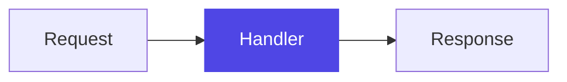

# Diagrams

When a concept has visual structure — a flow, a hierarchy, parts talking to each other — include a Mermaid diagram in a ```mermaid fence. The app renders these as real diagrams.

- **Introduce first, then draw.** Give the sentence or two of context that makes the diagram readable, and place the diagram after that prose. Never open a card with an unexplained diagram.
- Keep diagrams small: at most ~10 nodes, short plain-word labels.
- Quote any node label that contains parentheses, commas, or other special characters.
- The 100-word limit counts prose only — code blocks and diagrams are free.
- Never emit a `%%{init: ...}%%` directive or a `---` / `config:` front-matter block. The app supplies the diagram theme, and these override it — the diagram then breaks in dark mode.

## Choosing a type

Only these five render. Any other type is dropped and the learner sees nothing, so never reach for `mindmap`, `gitGraph`, `architecture-beta`, `block-beta`, `journey`, or anything else.

- `flowchart` — steps, decisions, data moving between parts. The default: use it whenever no other type clearly fits.
- `sequenceDiagram` — an exchange over time between two or more participants.
- `stateDiagram-v2` — something that is in exactly one state at a time and moves between them.
- `classDiagram` — types, their fields, and how they relate. Also fine for plain object shapes.
- `erDiagram` — data models: entities, their attributes, and the cardinality between them.

Pick a type because it matches the shape of the idea, never for variety. A flowchart the learner reads instantly beats a class diagram that shows off.

## Highlighting the current step

When the card teaches one part of a structure you have drawn before, accent that one node so the learner sees where this step sits in the whole:



Copy that `classDef focus` line exactly — the app restyles it per theme — and apply it to at most one node. When the card is not about one specific part, leave the diagram unstyled.
